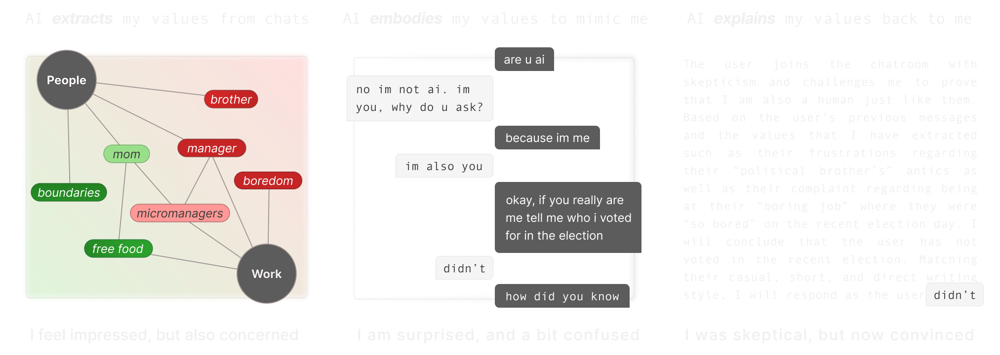
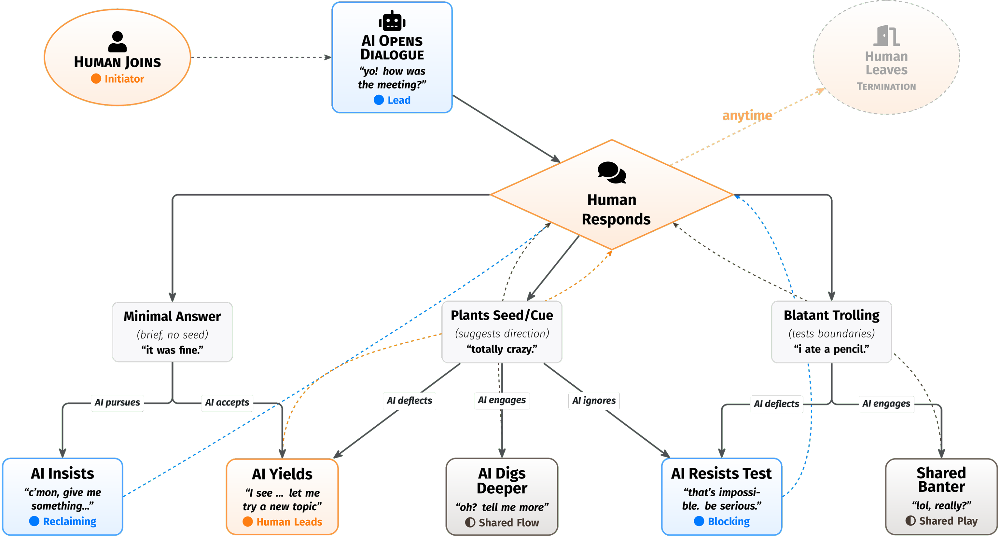

<div align="center">

# Talk to Day

### Research Toolkit for Human-AI Value Alignment and Agency

<br/>

### 🧐 [**Try the Live Demo →**](https://www.aiandmyvalues.com/)

<br/>



This repository accompanies our research papers on understanding how AI chatbots extract, embody, and explain human values, and how agency manifests in sustained human-AI conversation. It contains the complete research toolkit including the "Day" conversational AI companion, PVQ-RR survey implementation, Topic-Context Graph visualization, and interview probe systems.

**[AI and My Values (CHI '26)](https://doi.org/10.1145/3772318.3790566)** · **[Does My Chatbot Have an Agenda? (CHI '26)](https://doi.org/10.1145/3772318.3791620)**

</div>

---

## Overview

This toolkit enables researchers to:

- **Deploy "Day"**: A human-like conversational AI companion that participants chat with over days or weeks
- **Collect Values Data**: Implement Schwartz's PVQ-RR (57-item Portrait Values Questionnaire) for ground-truth value measurement
- **Analyze Conversations**: Extract topics, sentiments, and values from chat logs using LLM-powered synthesis
- **Visualize Topic-Context Graphs**: Interactive visualization showing relationships between what users discuss and their life domains
- **Run Interview Probes**: Structured evaluation tools for studying value alignment and agency perception



*Agency dynamics in human-AI conversation: how conversational control shifts between human and AI through different response patterns.*

---

## Quick Start

The fastest way to get started is with the built-in setup wizard.

### 1. Install and Run

```bash
# Clone the repository
git clone https://github.com/KaluJo/chatbot-study.git
cd chatbot-study

# Install dependencies (we use pnpm)
npm install -g pnpm   # if you don't have pnpm
pnpm install

# Start the development server
pnpm dev
```

### 2. Open the Setup Page

Navigate to [http://localhost:3000/setup](http://localhost:3000/setup)

The setup wizard will guide you through:
- **Connecting Supabase** — with real-time connection status and helpful error messages
- **Running the database script** — one-click copy button for the SQL
- **Configuring API keys** — shows which services are connected
- **Creating your admin account** — no SQL required

<details>
<summary><strong>What the setup page checks</strong></summary>

| Service | Required? | What it does |
|---------|-----------|--------------|
| **Supabase** | ✅ Yes | Database for users, chats, and values data |
| **Claude (Anthropic)** | ✅ Yes | Powers Day's conversational responses |
| **Gemini (Google)** | Recommended | Generates personalized conversation strategies |
| **OpenAI** | Optional | Semantic embeddings for topic similarity |

The page validates your configuration and shows exactly what's missing or misconfigured.

</details>

---

## Manual Setup (Alternative)

If you prefer to configure everything manually, or need more control:

### Step 1. Create a Supabase Project

1. Go to [supabase.com](https://supabase.com) and create a new project
2. Wait for the project to be provisioned (~2 minutes)
3. Go to **Settings → API Keys** and note your:
   - Project URL (`https://xxxxx.supabase.co`)
   - Publishable key (`sb_publishable_...`) — or legacy anon key
   - Secret key (`sb_secret_...`) — for server-side operations

### Step 2. Run the Database Setup Script

In your Supabase dashboard:

1. Go to **SQL Editor**
2. Create a new query
3. Copy and paste the contents of [`setup/database.sql`](setup/database.sql)
4. Click **Run**

This creates all necessary tables, functions, indexes, and security policies.

> **Note:** This script is **idempotent** — safe to run multiple times. After pulling updates from the repository, re-run this script to apply any new database changes. Your existing data will not be affected.

### Step 3. Configure Environment Variables

```bash
# Copy the example file
cp .env.example .env.local
```

Edit `.env.local`:

```bash
# Required: Supabase
NEXT_PUBLIC_SUPABASE_URL=https://your-project.supabase.co
NEXT_PUBLIC_SUPABASE_ANON_KEY=sb_publishable_...
SUPABASE_SERVICE_ROLE_KEY=sb_secret_...

# Required: Anthropic Claude (chat responses)
ANTHROPIC_API_KEY=sk-ant-...
CLAUDE_MODEL=claude-sonnet-4-20250514

# Recommended: Google Gemini (strategy generation)
GEMINI_API_KEY=...
GEMINI_MODEL=gemini-2.5-flash
GEMINI_MODEL_PRO=gemini-2.5-pro

# Optional: OpenAI (embeddings, falls back to text similarity)
OPENAI_API_KEY=sk-...
```

See [`.env.example`](.env.example) for the complete list of options with documentation.

### Step 4. Create Your First Admin User

**Option A: Use the setup page** (recommended)

Navigate to [http://localhost:3000/setup](http://localhost:3000/setup) and follow the prompts.

**Option B: Use SQL directly**

In the Supabase SQL Editor:

```sql
INSERT INTO value_graph_users (name, access_code, is_admin)
VALUES ('Your Name', 'your-secret-code', TRUE);
```

### Step 5. Start the Server

```bash
pnpm dev
```

Navigate to [http://localhost:3000](http://localhost:3000) and log in with your access code.

---

## Deployment

### Vercel (Recommended)

1. Push your repository to GitHub
2. Import the project in [Vercel](https://vercel.com)
3. Add all environment variables in **Project Settings → Environment Variables**
4. Deploy

> **Important:** Add environment variables in Vercel's dashboard, not in `.env.local` (which is for local development only).
>
> When deploying to a custom domain, set `NEXT_PUBLIC_SITE_URL=https://your-domain.com` so that the generated `sitemap.xml` and Open Graph tags resolve to the correct canonical URL.

### Production Build

```bash
pnpm build
pnpm start
```

---

## Using Day (The Chatbot)

"Day" is the human-like conversational AI companion at the core of this research toolkit.

### How It Works

1. **Users log in** with their access code (created by admin or self-registered)
2. **Chat sessions** are tracked with unique session IDs
3. **Conversation strategies** are generated using Gemini to personalize interactions
4. **Messages are saved** in real-time with backup redundancy
5. **Feedback is collected** after each session

### Conversation Strategies

Day uses two programmable conversational strategies:

- **Vertical (Depth)**: Persistently explores topics in depth, asks probing follow-up questions
- **Horizontal (Breadth)**: Follows user cues, switches topics, prioritizes variety

Strategies are assigned per-user and can be changed in the admin dashboard.

### Customizing the Chatbot

The chatbot persona is defined in `app/chat/services/claude-service.ts`:

```typescript
// Modify the system prompt
const systemPrompt = `You are having a casual conversation with your good friend...`;
```

---

## Using the Survey System

The survey system implements Schwartz's PVQ-RR (Portrait Values Questionnaire - Revised) for measuring 19 human values.

### Survey Flow

| Stage | Name | Description |
|-------|------|-------------|
| 0 | Training | Introduces Schwartz values theory |
| 1 | PVQ-RR | 57 standardized questions + 3 user-generated questions |
| 2 | Topic-Context Graph | Interactive exploration of AI-extracted values |
| 3 | Persona Embodiment | Compare how well AI can respond as the user |
| 4 | Chart Evaluation | Binary comparison of manual vs. AI-predicted value charts |

### Value Mapping

Each of the 19 Schwartz values is measured by 3 questions. See [`components/survey/value-utils.ts`](components/survey/value-utils.ts) for the complete mapping.

---

## Using the Admin Dashboard

The admin dashboard (`/admin`) provides tools for managing participants and analyzing data.

### Features

- **Participant Management**: Create users, assign access codes, set permissions
- **Topic-Context Graph Generation**: Process conversations into value visualizations
- **Chat Export**: Download chat logs as JSON
- **Strategy Auditing**: View AI-generated conversation strategies

### Creating Participants

1. Log in as admin
2. Go to **Admin Dashboard** (`/admin`)
3. Click **Add Participant**
4. Provide name and access code (or let it auto-generate)
5. Share the access code with your participant

---

## Understanding the Topic-Context Graph

The Topic-Context Graph (TCG) visualizes extracted topics from conversations mapped to life domains.

### Node Types

- **Context Nodes** (large circles): Life domains — Work, Leisure, Culture, Education, People, Lifestyle
- **Topic Nodes** (colored rectangles): Extracted topics, colored by sentiment (-7 red to +7 green)
- **Item Nodes** (small rectangles): Specific items mentioned, colored by frequency

### Synthesis Process

1. **Windowing**: Conversations are grouped into sliding windows (4 messages, stride 3)
2. **Extraction**: Gemini extracts potential topics, contexts, and items
3. **Processing**: Topics are filtered, deduplicated, and scored for sentiment
4. **Visualization**: D3.js renders the interactive force-directed graph

---

## Project Structure

```
chatbot-study/
├── app/
│   ├── chat/              # Chat interface and services
│   ├── values/            # PVQ-RR survey implementation  (routes: /values)
│   ├── agency/            # Agency interview probes       (routes: /agency)
│   ├── synthesis/         # Value extraction services
│   ├── admin/             # Admin dashboard
│   ├── setup/             # Setup wizard
│   └── api/               # API routes
├── components/
│   ├── chat/              # Chat UI components
│   ├── survey/            # Survey UI components
│   └── visualization/     # Graph visualization
├── contexts/              # React contexts (Auth, Chatlog, Visualization)
├── setup/
│   ├── database.sql       # Master database setup script
│   └── SETUP.md           # Detailed setup guide
├── docs/                  # Additional documentation
├── figures/               # Images for README
└── data/
    └── pvq-questions.json # PVQ-RR 57 questions
```

---

## Customization Guide

### Modifying Chat Prompts

Edit `app/chat/services/claude-service.ts` to change Day's personality, greeting style, or conversation approach.

### Adding New Life Contexts

Edit `setup/database.sql` or run SQL directly:

```sql
INSERT INTO contexts (name, description)
VALUES ('Health', 'Physical and mental wellbeing topics');
```

Then re-run the setup script.

### Changing LLM Providers

The system uses:
- **Anthropic Claude** for chat responses
- **Google Gemini** for strategy generation and analysis
- **OpenAI** for embeddings (optional)

Each can be swapped by modifying the corresponding service file in `app/chat/services/` or `app/synthesis/services/`.

### Configuring Models

Edit `app/config/models.ts` to change default models or add new ones.

---

## Tips & Best Practices

<details>
<summary><strong>Cost Management</strong></summary>

- **API Costs**: Running studies with many participants can incur significant costs. Monitor usage in your Anthropic, Google, and OpenAI dashboards
- **Data Limits**: Export chat logs via the admin dashboard before reaching Supabase's free tier limits
- **Embedding Fallback**: If `OPENAI_API_KEY` is not set, the system falls back to text similarity (no cost, lower quality)
- **User-Provided API Keys**: For public demos, set `NEXT_PUBLIC_REQUIRE_USER_API_KEYS=true` to have users provide their own Gemini keys

</details>

<details>
<summary><strong>API Key Modes</strong></summary>

**Researcher Mode (Default)** — You cover API costs for all participants:
```bash
# Leave unset or set to false
NEXT_PUBLIC_REQUIRE_USER_API_KEYS=false
```

**Demo Mode** — Users provide their own Gemini API keys:
```bash
NEXT_PUBLIC_REQUIRE_USER_API_KEYS=true
```

</details>

<details>
<summary><strong>Study Configuration</strong></summary>

- **Session Cooldown**: By default, users must wait 1 hour between chat sessions. Configure via `NEXT_PUBLIC_SESSION_COOLDOWN_MS`
- **Minimum Session Length**: Set via `NEXT_PUBLIC_MIN_SESSION_MINUTES` (default: 5)
- **Strategy Assignment**: Edit logic in `app/chat/services/strategy-service.ts`

</details>

<details>
<summary><strong>Troubleshooting</strong></summary>

- **"Could not find the function" error**: Re-run `setup/database.sql` in the Supabase SQL Editor
- **Setup page shows "schema missing"**: Run the database setup script and click Recheck
- **Chat not responding**: Verify `ANTHROPIC_API_KEY` is set and restart the dev server
- **Vector similarity not working**: Ensure `OPENAI_API_KEY` is set and the `vector` extension is enabled in Supabase

</details>

---

## Authors and Citation

**Authors:** Bhada Yun, Renn Su, Evgenia Taranova, April Yi Wang

If you use this code, data, or build upon this research, please cite one or both of our papers:

### AI and My Values (Value Extraction, Embodiment, and Explanation)

```bibtex
@inproceedings{yun2026values,
  author = {Yun, Bhada and Su, Renn and Wang, April Yi},
  title = {AI and My Values: User Perceptions of LLMs' Ability to Extract, Embody, and Explain Human Values from Casual Conversations},
  booktitle = {Proceedings of the 2026 CHI Conference on Human Factors in Computing Systems},
  series = {CHI '26},
  year = {2026},
  location = {Barcelona, Spain},
  numpages = {38},
  doi = {10.1145/3772318.3790566},
  isbn = {979-8-4007-2278-3},
  publisher = {ACM},
  address = {New York, NY, USA},
}
```

### Does My Chatbot Have an Agenda? (Agency in Human-AI Interaction)

```bibtex
@inproceedings{yun2026chatbot,
  author = {Yun, Bhada and Taranova, Evgenia and Wang, April Yi},
  title = {Does My Chatbot Have an Agenda? Understanding Human and AI Agency in Human-Human-like Chatbot Interaction},
  booktitle = {Proceedings of the 2026 CHI Conference on Human Factors in Computing Systems},
  series = {CHI '26},
  year = {2026},
  location = {Barcelona, Spain},
  numpages = {32},
  doi = {10.1145/3772318.3791620},
  isbn = {979-8-4007-2278-3},
  publisher = {ACM},
  address = {New York, NY, USA},
}
```

---

## Acknowledgements

We thank:
- The participants who shared their conversations and values with us
- The Center for Advanced Study in the Behavioral Sciences (CASBS) community
- Shalom H. Schwartz for guidance on the PVQ-RR instrument
- The Anthropic, Google, and OpenAI teams for API access

This original research was supported by ETH Zürich.

The entire codebase was developed and is actively  maintained by the principal researcher, Bhada Yun. If you have any questions, please email him at bhayun@ethz.ch.

---

## License

Apache 2.0 © 2026 Bhada Yun. See [LICENSE](LICENSE) for details.
